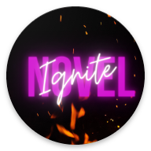
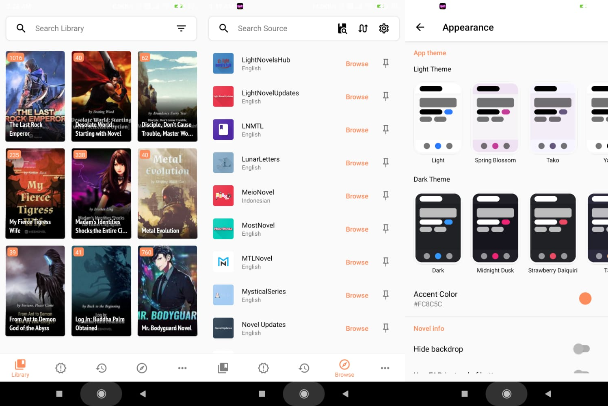

Notice to Our Users:

We are excited to announce the launch of our new product, InkNest! InkNest offers a vast collection of comic books for free, available right at your fingertips. Dive into an immersive comic reading experience with our intuitive and user-friendly app.

In light of this new launch, we regret to inform you that Ignite Novel is being taken down permanently. We appreciate your understanding and encourage you to explore our new offering.

Check out InkNest here link: [InkNest Download](https://github.com/p2devs/InkNest/releases)

Thank you for your continued support.

  

  
<h1 align="center">
  Ignite Novel
</h1>

  Ignite Novel is a Tachiyomi-like, free, and light novel reader for Android.

  

## Download
Get the app from our [releases page](https://github.com/pushpender-singh-ap/ignitenovel-release/releases).

## License
[GNU General Public License v3.0 ](https://github.com/pushpender-singh-ap/ignitenovel-release/blob/master/LICENCE)
